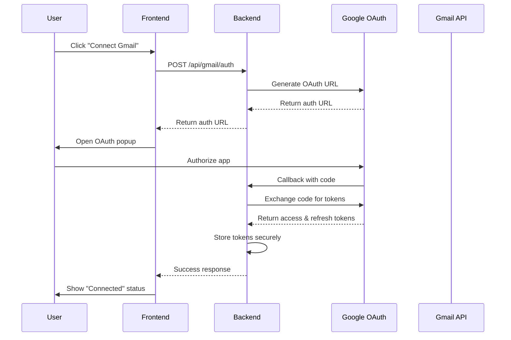
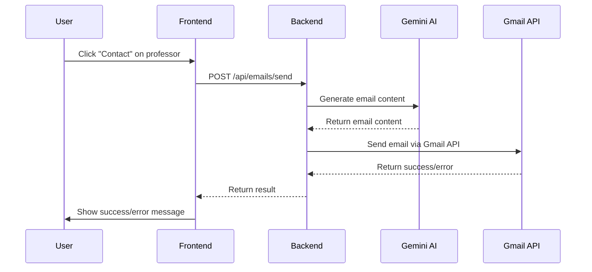

# Gmail Integration Guide

This guide explains how the Gmail integration works in the Professor Matcher app, allowing users to send emails directly to professors with just a click.

## 🚀 Features

- **One-Click Email Sending**: Send personalized emails to professors directly from the app
- **OAuth 2.0 Authentication**: Secure Gmail account connection using Google's OAuth flow
- **Automatic Email Generation**: AI-powered email content generation based on professor and student profiles
- **Error Handling & Fallbacks**: Graceful error handling with mailto fallback when Gmail is unavailable
- **Retry Logic**: Automatic retry with exponential backoff for transient failures
- **Real-time Feedback**: Loading states and detailed error messages for better UX

## 🔧 How It Works

### 1. Gmail Authentication Flow



### 2. Email Sending Flow



## 🛠️ Technical Implementation

### Backend Components

#### 1. Gmail Service (`backend/services/gmailService.js`)
- Handles OAuth 2.0 authentication
- Manages access token refresh
- Formats emails according to Gmail API requirements
- Implements retry logic with exponential backoff
- Provides proper MIME formatting for Gmail API

#### 2. Gmail Routes (`backend/routes/gmail.js`)
- `/api/gmail/auth` - Initiate OAuth flow
- `/api/gmail/oauth-callback` - Handle OAuth callback
- `/api/gmail/test/:userId` - Test Gmail connection
- `/api/gmail/status/:userId` - Check Gmail status
- `/api/gmail/disconnect/:userId` - Disconnect Gmail

#### 3. Email Routes (`backend/routes/emails.js`)
- `/api/emails/send` - Send email to professor
- Enhanced error handling with specific error codes
- Fallback to mailto links when Gmail fails

### Frontend Components

#### 1. Professor Match Page (`src/pages/ProfessorMatch.tsx`)
- Enhanced Contact button with loading states
- Better error handling and user feedback
- Automatic mailto fallback when Gmail fails

#### 2. Email Settings Page (`src/pages/EmailSettings.tsx`)
- Gmail connection management
- Connection status display
- Test connection functionality

## 🔐 Security Features

### OAuth 2.0 Implementation
- Uses Google's official OAuth 2.0 flow
- Stores only refresh tokens (never access tokens)
- Implements proper token refresh mechanism
- Follows Google's security best practices

### Token Management
- Encrypted storage of refresh tokens
- Automatic token refresh before expiration
- Secure token exchange on server-side only
- No client-side token exposure

### Error Handling
- Specific error messages for different failure types
- No sensitive information in error responses
- Proper HTTP status codes for different scenarios

## 📋 Setup Instructions

### 1. Google Cloud Console Setup

1. Go to [Google Cloud Console](https://console.cloud.google.com/)
2. Create a new project or select existing one
3. Enable the Gmail API
4. Create OAuth 2.0 credentials
5. Add authorized redirect URIs:
   - `http://localhost:3000/oauth-callback` (development)
   - `https://yourdomain.com/oauth-callback` (production)

### 2. Environment Variables

Add these to your `.env` file:

```env
GOOGLE_CLIENT_ID=your_client_id_here
GOOGLE_CLIENT_SECRET=your_client_secret_here
GOOGLE_REDIRECT_URI=http://localhost:3000/oauth-callback
```

### 3. OAuth Scopes

The app requests these scopes:
- `https://www.googleapis.com/auth/gmail.send` - Send emails
- `https://www.googleapis.com/auth/userinfo.email` - Get user email
- `https://www.googleapis.com/auth/userinfo.profile` - Get user profile

## 🚀 Usage

### For Users

1. **Connect Gmail Account**:
   - Go to Email Settings
   - Click "Connect Gmail"
   - Complete OAuth authorization
   - Verify connection status

2. **Send Emails to Professors**:
   - Search for professors in Professor Match
   - Click "Contact" button next to any professor
   - Email is automatically generated and sent
   - Check status message for confirmation

### For Developers

#### Testing the Integration

```bash
# Run the test script
node test-gmail-integration.js
```

#### API Endpoints

```javascript
// Check Gmail status
GET /api/gmail/status/:userId

// Test Gmail connection
GET /api/gmail/test/:userId

// Send email to professor
POST /api/emails/send
{
  "to": "professor@university.edu",
  "professorName": "Dr. Smith",
  "professorTitle": "Professor",
  "professorDepartment": "Computer Science",
  "researchAreas": ["Machine Learning"],
  "studentName": "John Doe",
  "studentEmail": "john@student.edu",
  "studentBackground": "Computer Science Student",
  "matchingReason": "Research interest match",
  "userId": "user123"
}
```

## 🔧 Troubleshooting

### Common Issues

1. **"Gmail authentication failed"**
   - User needs to reconnect Gmail account
   - Check OAuth credentials in environment variables

2. **"Gmail quota exceeded"**
   - Gmail API has daily sending limits
   - Wait for quota reset or use mailto fallback

3. **"Gmail API access disabled"**
   - Check Google Cloud Console settings
   - Ensure Gmail API is enabled
   - Verify OAuth consent screen configuration

4. **"Permissions insufficient"**
   - User needs to grant required scopes
   - Reconnect Gmail account with proper permissions

### Debug Mode

Enable debug logging by setting:
```env
DEBUG=gmail:*
```

## 📊 Monitoring

### Metrics to Track
- Email send success rate
- Gmail API quota usage
- Token refresh failures
- User authentication success rate

### Logs
- All Gmail API calls are logged
- Error details are captured
- Token refresh attempts are tracked

## 🔄 Future Enhancements

1. **Draft Support**: Save emails as drafts before sending
2. **Email Templates**: Pre-defined email templates
3. **Scheduling**: Schedule emails for later sending
4. **Analytics**: Track email open rates and responses
5. **Bulk Sending**: Send to multiple professors at once

## 📚 References

- [Gmail API Documentation](https://developers.google.com/gmail/api)
- [Google OAuth 2.0 Guide](https://developers.google.com/identity/protocols/oauth2)
- [Gmail API Scopes](https://developers.google.com/workspace/gmail/api/auth/scopes)
- [Gmail API Quotas](https://developers.google.com/workspace/gmail/api/reference/quota)


